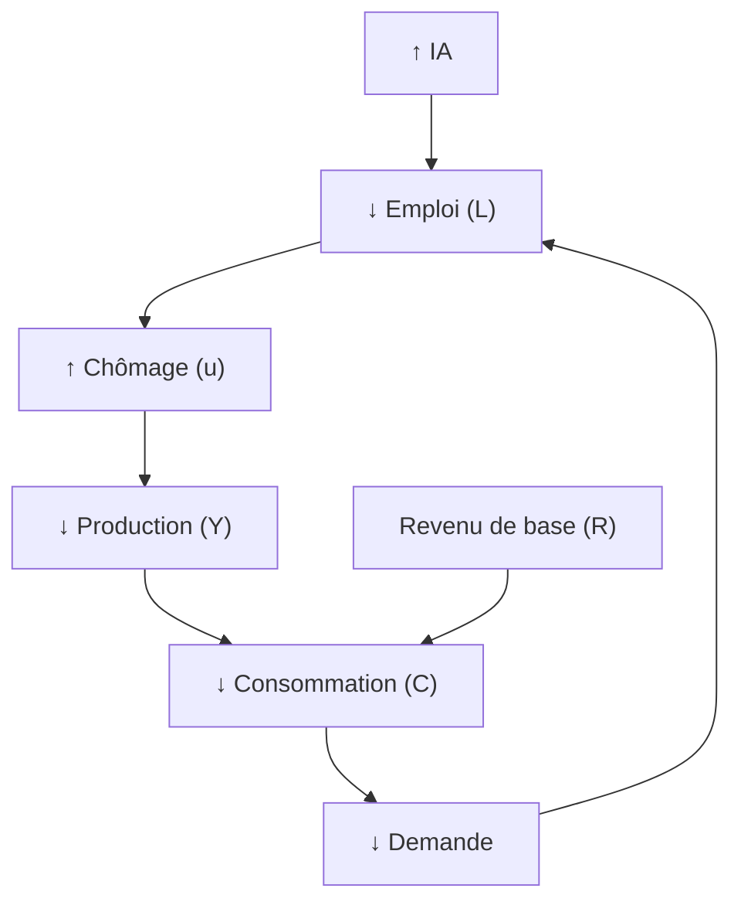

# IA, Chômage et Revenu de base
*Dynamique macro*

---

## 1. Impact IA sur l’emploi
- 27% tâches mondiales automatisées d’ici 2030 (EY, Insee)[web:29]
- Jusqu’à 20% chômage dans métiers exposés à l’IA (Anthropic, ONU)[web:3][web:5][web:14]

---

## 2. Fonction de production élargie

$$
Y = A \cdot K^{\alpha} \cdot \big((1-u)N\big)^\beta \cdot IA^\gamma
$$

Avec $u$ = taux de chômage. Si le chômage monte, $L = (1-u)N$ baisse, la production baisse même si IA monte[web:26][web:38].

---

## 3. Boucle macroéconomique (Mermaid)

---

## 4. Consommation totale

$$
C = c_1 \cdot Y_{travail} + c_2 \cdot Y_{chomage} + N \cdot R
$$

- Sans revenu de base ($R=0$), C chute si chômage monte.
- Avec revenu de base ($R>0$), C se maintient même en chômage élevé[web:7][web:41][web:38].

---

## 5. Effet multiplicateur
$$
\Delta Y = \frac{1}{1-c} \cdot \Delta R
$$
Soutient production en période de chômage grâce à R.

---

## 6. Conclusion
- IA = productivité, mais risque chômage élevé et contraction de la demande
- Le revenu de base stabilise la demande et la production, cassant le cercle négatif

---

## Sources principales
EY, Insee, OCDE, Anthropic, ONU, BNP Paribas, Trésor Éco, Wikipedia, Mouvement Français Revenu de Base, Fondapol, Terra Nova, INSEE, Aghion & Antonin
---
download: true