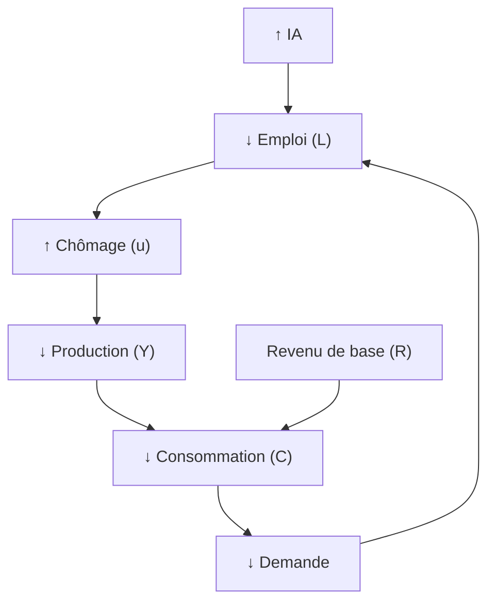

# L'IA en un Quinquennat
*Le revenu universel, une necessité*

## Fabien FURFARO - 2025

---
layout: default
---

## Evolution du marché de l'emploi depuis 1960
***Automatisation et Abondance : Une mutation vers le tertiaire***

```mermaid {theme: 'neutral', scale: 0.5}
---
config:
  themeVariables:
    xyChart:
      showDataLabel: true
      plotColorPalette: ' #2E8B57, #1E90FF, #FF8C00, #800080, #DC143C'
---
xychart
title "Evolution des secteurs d'activité et taux de chômage en France"
x-axis "Années" [1962, 1975, 1990, 2007, 2018]
y-axis "Pourcentage (%)" 0 --> 100

bar "Agriculture" [100, 100, 100, 100, 100]
bar "Industrie" [80.39, 84.54, 90.83, 96.30, 98.11]
bar "Construction" [42.16, 53.61, 66.06, 75.93, 85.85]
bar "Tertiaire" [35.29, 46.39, 60.55, 69.44, 79.25]
bar "Taux de chômage" [1.96, 7.22, 8.26, 7.41, 7.55]
```

  

  
<!-- Voir les données dans le tableur ods -->

🟩 Agriculture
🟦 Industrie
🟧 Construction
🟪 Tertiaire
🟥 Taux de chômage

  

  

  
📻 1950 : Transistor.    🛢️ 1970 : 1er Pic.    🌐 1990 : Internet.

**Destruction creatrice :** Processus économique où l'innovation remplace les anciennes activités, stimulant la croissance.

*On remarque qu'on a surtout une transition des secteurs d'activités vers le tertiaire, dans une période en abondance énergétique.*

Selon le **OCDE**, d’ici 2030, 30% des emplois seront confrontés à des transformations structurelles majeures et près de **50%** des métier du tertiaire.

  
  

Est-ce-que l'intelligence artificielle va stimuler la croissance ?

***Sources :*** <a href="https://www.insee.fr/fr/statistiques/1283207" target="_blank">INSEE</a>, <a href="https://www.clubofrome.org/publication/the-limits-to-growth/" target="_blank">Rapport Meadows (1972)</a>, <a href="https://www.oecd.org/en/topics/ai-and-work.html" target="_blank">OCDE</a>

---
layout: two-cols-header
---

## Pourquoi la course à l'IA a commencé ?
***Entre compétition et cout d'opportunité***

**La formule de Cobb-Douglas :**

$$
Y = A \cdot K^{\alpha} \cdot L^{\beta} \cdot IA^{\gamma}
$$

::left::

$$
\Delta Y = \frac{1}{1-c} \cdot \Delta R
$$

::right::

(\( c \) : propension marginale à consommer)[web:7][web:24]
- Scénario dual :  
  - Emplois qualifiés : +reconversion, +emplois « augmentés »
  - Non qualifiés : risque chômage structurel 30–40 % (OCDE)[web:21][web:27]

***Sources :*** <a href="https://economic-research.bnpparibas.com/html/fr-FR/Productivite-croissance-emploi-IA-synthese-litterature-economique-05/09/2025,51811" target="_blank">BNP Paribas</a>

---

## Pourquoi la course à l'IA a commencé ?
***Entre compétition et cout d'opportunité***

On investi dans l'IA car nous sommes en compétition et que le gain peut etre tres grand si on atteint l'AGI.

Les modélisations BNP Paribas et Trésor Éco (Direction générale du Trésor, 2024) utilisent des fonctions de production Cobb-Douglas modifiées où la croissance de la productivité par l’IA (γγ) compense partiellement la baisse de l’emploi direct, modulée par secteur et qualification.

$$
Y = A \cdot K^{\alpha} \cdot L^{\beta} \cdot IA^{\gamma}
$$
(\( \gamma > 0 \) : impact IA sur production)[web:23][web:26]
- Effet multiplicateur :  
$$
\Delta Y = \frac{1}{1-c} \cdot \Delta R
$$
(\( c \) : propension marginale à consommer)[web:7][web:24]
- Scénario dual :  
  - Emplois qualifiés : +reconversion, +emplois « augmentés »
  - Non qualifiés : risque chômage structurel 30–40 % (OCDE)[web:21][web:27]

---

## Est-ce-que l'IA est une révolution technologique ?
***Une révolution technogolique transforme tout les secteurs***

Le mythe de la destruction créatrice

Des IA de plus en plus compact.

La loi d'echelle a montré ces limites. Evaluation par niveau de confiance et raisonnement.

Lorsque l'IA sera appliqué à la robotique, tout les métiers seront impacté

---

## Un paradoxe evident oublié des économistes
***Comment une société basé sur la consommation peut fonctionner sans travail ?***

La logique de l'AGI est d'avoir une entité capable de realiser toute les activité humaines. Dans une logique de rentabilité, tout les métiers vont disparaitre, de l'executif jusqu'à la prise de decision.

Si on introduit le taux de chomage dans les modeles, Fonction de production élargie :

$$
Y = A \cdot K^{\alpha} \cdot \big((1-u)N\big)^\beta \cdot IA^\gamma
$$

Avec $u$ = taux de chômage. Si le chômage monte, $L = (1-u)N$ baisse, la production baisse même si IA monte[web:26][web:38].

manquement dans les modele : 

| Type de modèle                     | Objectif principal                             | Intégration IA actuelle                                                                                   |
|-----------------------------------|-----------------------------------------------|------------------------------------------------------------------------------------------------------------|
| Macromodèles (DSGE, CGE etc.)     | Croissance, PIB, productivité, emploi         | IA comme choc technologique sur productivité, innovation et emploi (modèles étendus Cobb-Douglas) - Modele Mesange ou Opale étendu          |
| Micromodèles (micro-simulations)  | Redistribution, fiscalité, emploi par ménage  | IA pour simuler changements de tâches, revenus, formations, redistribution (ex : TaxIPP étendu)            |

---

## Le revenu de base une outil necessaire pour une transition sociale
***Comment le revenu de base va stabiliser la societe ?***

Consommation totale :

$$
C = c_1 \cdot Y_{travail} + c_2 \cdot Y_{chomage} + N \cdot R
$$

- Sans revenu de base ($R=0$), C chute si chômage monte.
- Avec revenu de base ($R>0$), C se maintient même en chômage élevé[web:7][web:41][web:38].

Boucle macroéconomique :

---

## Quelque debunkage sur l'IA
***Ce n'est pas ce que l'on croit***

Le capitalisme n'est pas la nature de l'homme --> propriété + paradoxe de hotelling

néanmoins, besoin d'accumulation de ressource (argent % ressource % pollution) et notre besoin d'etre superieur est à reduire.

AI 2027 est une caricature, les chinois sont ceux qui mettent le plus de techno open source contrairement au USA

Une economique ne marche pas en forcant les gens à travaillé si eux meme peuvent deleguer à un robot

La creation n'est pas divine ou un truc magique, c'est qu'un processus de mutation/selection

Les comparaisons historique douteuse, les luddisme et le report au capitalisme

aussi, le manicheisme ou le complot : les entreprise de l'ia vont faire le mal pour garder le pouvoir ! tout ce genre d'affirmation doit etre associé à des preuves, pas uniquement des opinions/ressenti

Néanmoins, logique de compet dangeureux, valoriser la cooperation !

---

## Le revenu de base une outil necessaire pour une transition sociale
***Comment le revenu de base va transformer la societe ?***

Fin du systeme actuel, une utopie est possible, mais sans moyen, le risque est eleve ! 

Ou le revenu de base est un outils qui favorise la cooperation et le partage, des logiques souhaitable pour un monde comme le notre en crise d'individualisme.

---

## Evolution du marché de l'emploi
#### De 1960 à demain

---

## Evolution du marché de l'emploi
#### De 1960 à demain

```mermaid {theme: 'neutral', scale: 0.5}
---
config:
  themeVariables:
    xyChart:
      plotColorPalette: '#2E8B57, #1E90FF, #FF8C00, #800080, #DC143C'
---
xychart
title "Evolution des secteurs d'activité et taux de chômage en France"
x-axis "Années" [1962, 1975, 1990, 2007, 2018, 2025]
y-axis "Pourcentage (%)" 0 --> 80

bar "Agriculture" [20, 15, 10, 4, 2.5, 2.5]
bar "Industrie" [39, 30, 27, 22, 13.3, 13]
bar "Construction" [6.7, 7, 6, 7, 6.7, 6.7]
bar "Tertiaire" [34, 38, 57, 67, 76.1, 76]
bar "Taux de chômage" [2, 7, 9, 8, 8.5, 7.5]

```

| Couleur       | Catégorie      |
|---------------|----------------|
|  | Agriculture    |
|  | Industrie      |
|  | Construction   |
|  | Tertiaire      |
|  | Taux de chômage|

### Sources

- INSEE, "50 ans de mutations de l’emploi" [insee.fr/statistiques/1283207](https://www.insee.fr/fr/statistiques/1283207)  
- INSEE, Évolution du chômage France (BIT / enquêtes emploi)  
- TradingEconomics, taux de chômage France 1975-2025 [tradingeconomics.com/france/unemployment-rate](https://fr.tradingeconomics.com/france/unemployment-rate)  
- Wikipedia, Histoire du chômage en France [fr.wikipedia.org/wiki/Histoire_du_chômage_en_France](https://fr.wikipedia.org/wiki/Histoire_du_chômage_en_France)

---

## 1. Impact IA sur l’emploi
- 27% tâches mondiales automatisées d’ici 2030 (EY, Insee)
- Jusqu’à 20% chômage dans métiers exposés à l’IA (Anthropic, ONU)

---

## 2. Fonction de production élargie

$$
Y = A \cdot K^{\alpha} \cdot \big((1-u)N\big)^\beta \cdot IA^\gamma
$$

Avec $u$ = taux de chômage. Si le chômage monte, $L = (1-u)N$ baisse, la production baisse même si IA monte[web:26][web:38].

---

## 3. Boucle macroéconomique (Mermaid)

---

## 4. Consommation totale

$$
C = c_1 \cdot Y_{travail} + c_2 \cdot Y_{chomage} + N \cdot R
$$

- Sans revenu de base ($R=0$), C chute si chômage monte.
- Avec revenu de base ($R>0$), C se maintient même en chômage élevé[web:7][web:41][web:38].

---

## 5. Effet multiplicateur
$$
\Delta Y = \frac{1}{1-c} \cdot \Delta R
$$
Soutient production en période de chômage grâce à R.

---

## 6. Conclusion
- IA = productivité, mais risque chômage élevé et contraction de la demande
- Le revenu de base stabilise la demande et la production, cassant le cercle négatif

---

## Sources principales
EY, Insee, OCDE, Anthropic, ONU, BNP Paribas, Trésor Éco, Wikipedia, Mouvement Français Revenu de Base, Fondapol, Terra Nova, INSEE, Aghion & Antonin
---