```mermaid {theme: 'neutral', scale: 0.5}
---
config:
    xyChart:
        width: 700
        height: 600
---
xychart
    title "Marché mondial d'investissement en IA (2020-2030)"
    x-axis [2020, 2021, 2022, 2023, 2024, 2025, 2026, 2027, 2028, 2029, 2030]
    y-axis "USD (milliards)" 0 --> 3500
    bar [30, 50, 80, 515, 719, 900, 1161, 1580, 2100, 2740, 3497]
    bar [30, 50, 80, 515, 719, 900]
    line [10, 20, 30, 435, 204, 181, 261, 419, 520, 640, 757]
```

<style>
h1 {
  font-size: 1rem;
}
p {
  font-size: 1rem;
}
</style>

# L'IA en un Quinquennat
*Le revenu universel, une necessité*

## Fabien FURFARO - 2025


---
layout: default
---

## Evolution du marché de l'emploi depuis 1960
***Automatisation et Abondance : Une mutation vers le tertiaire***

```mermaid {theme: 'neutral', scale: 0.5}
---
config:
  themeVariables:
    xyChart:
      showDataLabel: true
      plotColorPalette: ' #2E8B57, #1E90FF, #FF8C00, #800080, #DC143C'
---
xychart
title "Evolution des secteurs d'activité et taux de chômage en France"
x-axis "Années" [1962, 1975, 1990, 2007, 2018]
y-axis "Pourcentage (%)" 0 --> 100

bar "Agriculture" [100, 100, 100, 100, 100]
bar "Industrie" [80.39, 84.54, 90.83, 96.30, 98.11]
bar "Construction" [42.16, 53.61, 66.06, 75.93, 85.85]
bar "Tertiaire" [35.29, 46.39, 60.55, 69.44, 79.25]
bar "Taux de chômage" [1.96, 7.22, 8.26, 7.41, 7.55]
```


<div grid="~ cols-2 gap-4">
  <div style="text-align: center; line-height: 1.2;">

<div style="text-align: center;">

</div>
  
<!-- Voir les données dans le tableur ods -->

🟩 Agriculture
🟦 Industrie
🟧 Construction
🟪 Tertiaire
🟥 Taux de chômage

  </div>
  <div>
  
📻 1950 : Transistor.    🛢️ 1970 : 1er Pic.    🌐 1990 : Internet.

**Destruction creatrice :** Processus économique où l'innovation remplace les anciennes activités, stimulant la croissance.

*On remarque qu'on a surtout une transition des secteurs d'activités vers le tertiaire, dans une période en abondance énergétique.*

Selon le **OCDE**, d’ici 2030, 30% des emplois seront confrontés à des transformations structurelles majeures et près de **50%** des métier du tertiaire.

  
  </div>
</div>

<div style="text-align: right">

***Sources :*** <a href="https://www.insee.fr/fr/statistiques/1283207" target="_blank">INSEE</a>, <a href="https://www.clubofrome.org/publication/the-limits-to-growth/" target="_blank">Rapport Meadows (1972)</a>, <a href="https://www.oecd.org/en/topics/ai-and-work.html" target="_blank">OCDE</a>

</div>


---
layout: two-cols-header
---

## Pourquoi la course à l'IA a commencé ?
***Entre compétition et cout d'opportunité (macro-énonomie)***

```text
La course à l’IA est motivée par la nécessité d’éviter de perdre un avantage stratégique de rentabilité et 
de croissance face à la montée en puissance rapide de cette technologie, malgré les coûts qu’elle implique.
```

**La formule de Cobb-Douglas :** $Y = A \cdot K^{\alpha} \cdot L^{\beta}$

**Le multiplicateur keynésien :** $\Delta Y = \frac{1}{1-c} \cdot \Delta R$


::left::

- **Y** : Production totale (PIB)
- **A** : Niveau technologique (PGF)
- **K** : Capital (Stock)  
- **L** : Travail (Humain + IA)
- **α, β** : Élasticités de la production
- **ΔR** : Variation de la demande (% Revenu)  
- **c** : Propension à consommer


::right::


- **Scénario dual :**  
  - Emplois qualifiés : emplois « augmentés »
  - Non qualifiés : chômage structurel

Consensus économique : *L’augmentation de la productivité par l’IA nécessite un accompagnement social et politique pour réussir la transition.*

<div style="text-align: right; font-size: 0.75em;">

***Sources :*** <a href="https://economic-research.bnpparibas.com/html/fr-FR/Productivite-croissance-emploi-IA-synthese-litterature-economique-05/09/2025,51811" target="_blank">BNP Paribas</a>, <a href="https://www.imf.org/en/Publications/WP/Issues/2025/04/11/The-Global-Impact-of-AI-Mind-the-Gap-566129" target="_blank">FMI</a>

</div>


---
layout: two-cols-header
---

## Pourquoi autant d'investissement dans l'IA ?
***La promesse d'une nouvelle révolution technologique ?***

```text
L’intelligence artificielle générale (AGI) serait une révolution technologique parce qu’elle permettrait de réaliser 
et d’améliorer des tâches humaines complexes dans tout les secteurs économiques.
```

::left::



::right::

Des entreprises comme *OpenAI* (IA), *NVIDIA* (hardware) et *Unitree* (robotique) misent sur le developpement de l’**AGI**.

En France, le **rapport Villani** souligne l’enjeu stratégique national lié à l’IA, encourageant l'investissements.

L’**AGI** représente une promesse d’innovation exponentielle, justifiant l’ampleur des capitaux levés et des efforts industriels.

L'**AGI** <ins>par définition</ins> pourrait remplacer tout les métiers de façon à etre <ins>plus efficace et performant</ins>.

<div style="text-align: right; font-size: 0.75em;">

***Sources :*** <a href="https://openai.com/index/planning-for-agi-and-beyond/" target="_blank">OpenAI</a>, <a href="https://www.grandviewresearch.com/industry-analysis/artificial-intelligence-ai-market" target="_blank">GVR</a>, <a href="https://www.enseignementsup-recherche.gouv.fr/fr/la-strategie-francaise-en-intelligence-artificielle-49166" target="_blank">France 2030</a>
</div>


---
layout: two-cols-header
---

## A-t-on vraiment compris ce qu'implique l'AGI ?
***Ce n'est pas qu'une question de décomposition de tache, mais de généralisation humaine (micro-économie)***

```text
La solution idéale serait que les entreprises maintiennent leurs employés pour qu'ils 'consomment' 
(optimum de Pareto), mais la compétition avec la concurrence nous amènera à aucune solution collective.
```

::left::

$$\vert --^a -- A \overbrace{---}^x ------ B --^b -- \vert$$

Pour $a=b$, l'équilibre de Cournot-Nash est :

$$\frac{\partial \Pi_A}{\partial p_A}=\frac{\partial \Pi_B}{\partial p_B}=0 \to p_A=p_B=\frac{L}{2}$$


Dans une économie libérale en compétition, cette dynamique force toutes les entreprises à utiliser l’IA. **Résultat :** Aucun optimum de Pareto n’est atteint $(\pm L/3)$, car chaque entreprise cherche à maximiser ses performances de vente.


::right::

*Empreinte carbone d’un robot Unitree :* environ 2 tonnes de CO2, soit l’équivalent de la fabrication de 3 réfrigérateurs.

<ins>Prévision pour l’AGI :</ins>
- Date médiane : 2040.
- Probabilité moyenne : 50% d’ici 2032.
- **Remarque :** Le rapport AI-2027 est polarisant.

Si les ressources necessaires sont inférieurs à celle d'un humain, alors le remplacement est inévitable.

<div style="text-align: right; font-size: 0.75em;">

***Sources :*** <a href="https://arxiv.org/pdf/2502.15840" target="_blank">Vending-Bench</a>, <a href="https://ai-2027.com/" target="_blank">AI-2027</a>, <a href="https://papers.ssrn.com/sol3/papers.cfm?abstract_id=4496418" target="_blank">Oxford</a>
</div>


---
layout: two-cols-header
---

## Le revenu universel est nécessaire pendant la transition
***Modèle macroéconomique étendu avec chômage et le RBU***

$$
Y = A \cdot K^{\alpha} \cdot \big((1-u) \cdot N\big)^{\beta}
$$

- $u$ : taux de chômage, $N$ : population active potentielle, $c_i$ : consommation des acteurs

La production totale $Y$ diminue lorsque le chômage augmente, même si la productivité liée à l’IA progresse. Une représentation simplifiée pour la consommation totale $C$ peut s’écrire :

$$
C = c_1 \cdot Y_{\text{travail}} + c_2 \cdot Y_{\text{chômage}} + N \cdot R
$$

- $R$ : revenu universel attribué à chaque individu, qui soutient la consommation même si le chômage augmente.  

En France, les modèlisations sont en cours d'amélioration (Mésange, TaxIPP, etc.) pour la prévoir les impacts de l'intelligence artificielle sur l'économie.

<div style="text-align: right; font-size: 0.75em;">

***Sources :*** <a href="https://papers.ssrn.com/sol3/papers.cfm?abstract_id=4843046" target="_blank">MIT</a>, <a href="https://www.tresor.economie.gouv.fr/Articles/2025/02/07/l-ia-au-coeur-des-analyses-de-la-dg-tresor" target="_blank">DG-Tresor</a>
</div>


---
layout: two-cols-header
---

## Au dela du revenu de base
***Paradoxes, choix sociaux et voies politiques***

*Paradoxe central :* Dans un monde sans travail, il n'y a plus de consommateur. Le revenu universel va stabiliser la demande lorsque la société sera en transition, mais ne résoudra pas la redistribution du pouvoir économique en cas d'AGI.

*Scénarios plausibles pre-AGI :* (1) baisse tendancielle du taux de profit, (2) recomposition sociale redistributive et (3) concentration autoritaire des rentes technologiques.

Considérer le RUB comme un outil qui permettra de changer de logique socio-économique pour s'orienter vers un monde post-économique coopératif (dans l'hypothèse où l'on atteind l'AGI).

```text
Refusons les récits simplistes — ni le luddisme pur ni l’essentialisme. Nous sommes face à un changement sans 
precedant historique, notre défi aujourd'hui est de trouver des solutions pour nous préparer positivement à l'avenir.
```


<div style="text-align: right; font-size: 0.75em;">

***Sources :*** <a href="https://arxiv.org/abs/2505.18687" target="_blank">Carnegie-Mellon</a>, <a href="https://academic.oup.com/oep/article/76/4/945/7630148" target="_blank">Oxford</a>, <a href="https://papers.ssrn.com/sol3/papers.cfm?abstract_id=4802513" target="_blank">Bath</a>, <a href="https://pmc.ncbi.nlm.nih.gov/articles/PMC9193369/" target="_blank">ILO</a>
</div>
